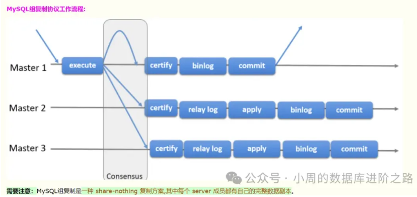

# 组复制可以在两种模式下运行:
1.在单主模式下，组复制具有自动选主功能，每次只有一个server成员接受更新。
2.在多主模式下，所有的 server 成员都可以同时接受更新。

# MySQL8.0.33 MGR多主一键搭建脚本。单主也适用，只需要改两个参数，将my.cnf参数文件中的以下参数注释即可:
#loose-group_replication_single_primary_mode = FALSE
#loose-group_replication_enforce_update_everywhere_checks = TRUE

# 理解
